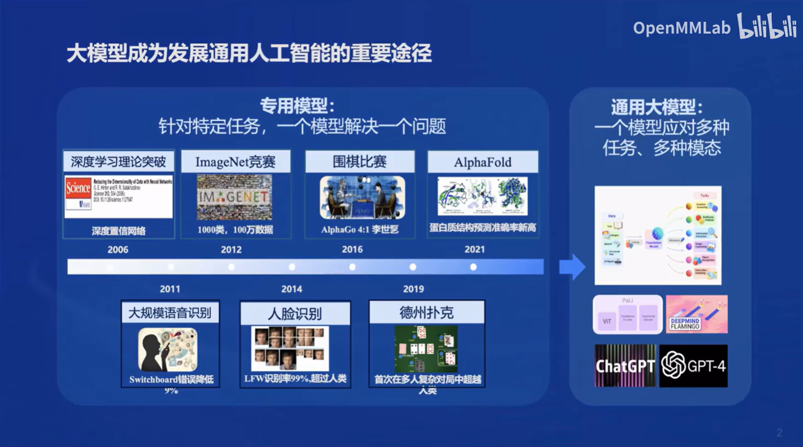
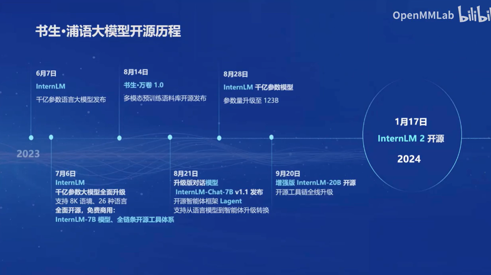
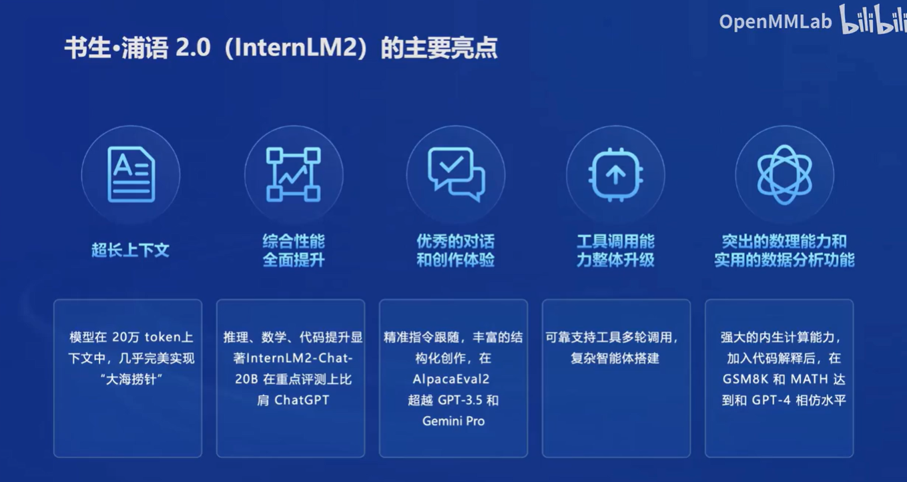
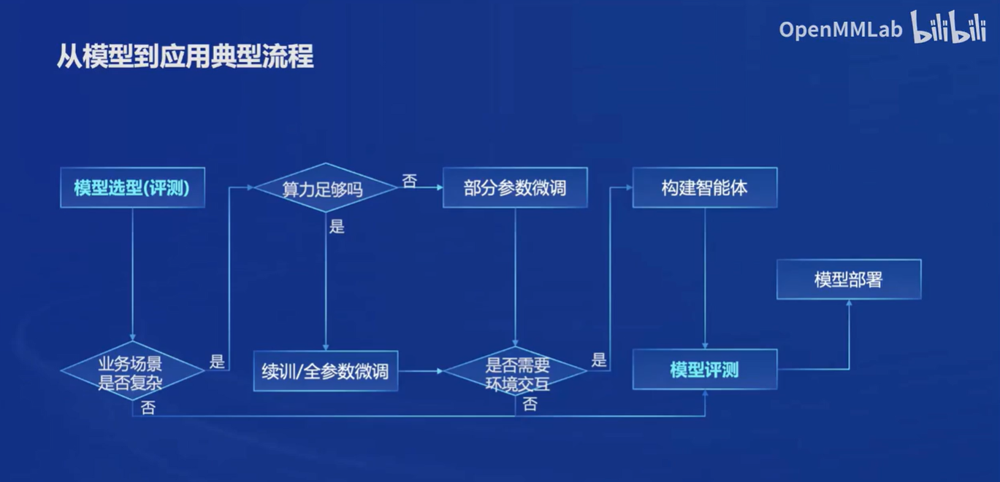
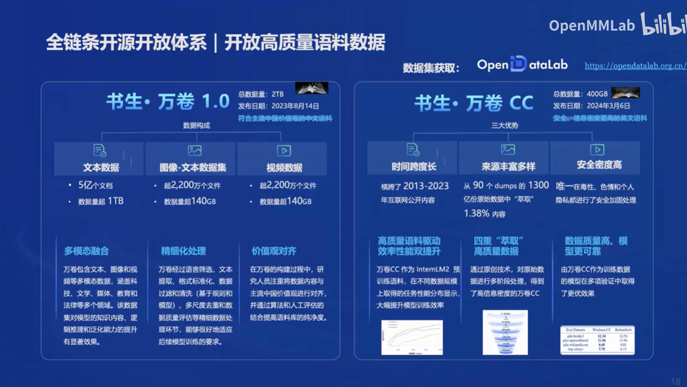
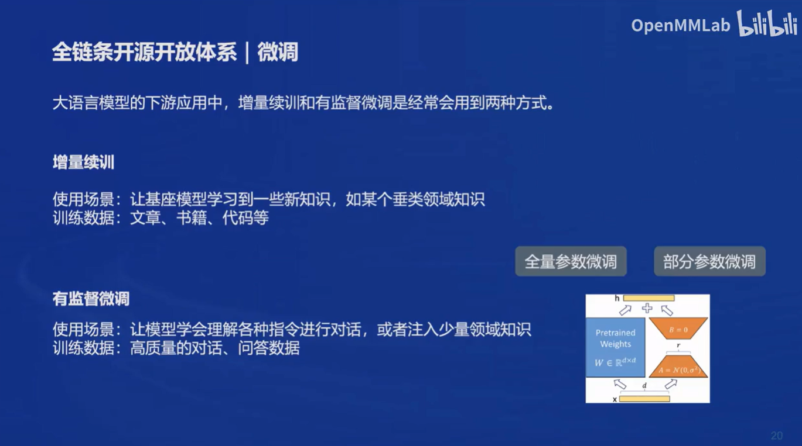
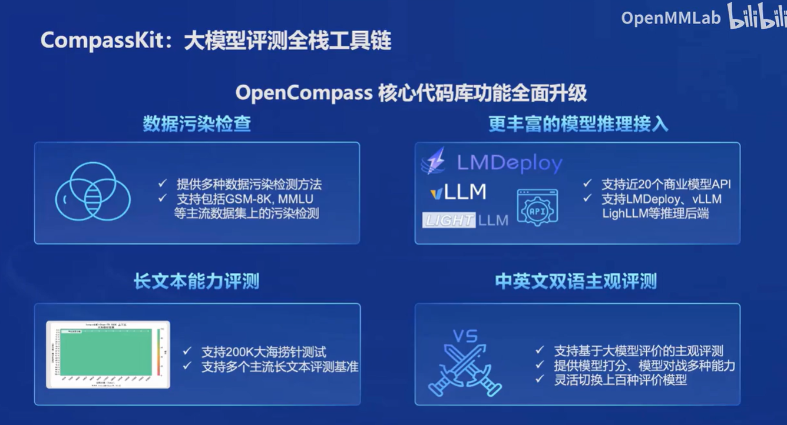
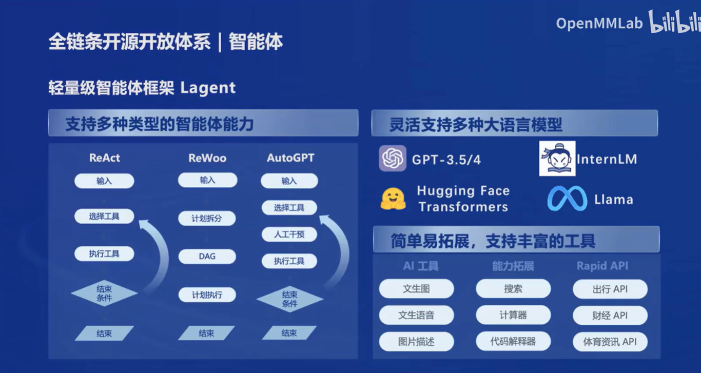

[书生·浦语大模型全链路开源体系](https://www.bilibili.com/video/BV1Vx421X72D/?spm_id_from=333.788&vd_source=5c38d549ff281cb47cf5a20a43a17256)
#书生·浦语实战营笔记（一）

    介绍了从深度学习发展之初到如今的通用大模型出现的发展历程

    介绍了书生·浦语大模型的开源历程

    书生·浦语2.0的主要亮点：200K的超长上下文，以及多智能体构建方面的优势

    从模型到应用典型流程，根据业务场景、是否需要环境交互以及算力是否足够来调整整体流程路线。

    书生·万卷：大规模的高质量语料数据库

    微调：本次实战营的学习重点

    CompassKit：在微调之后可以对模型进行评测，分析微调模型的整体性能

    LMDeploy：重点，部署是大模型走向应用的重要一步

    Lagent：比语言大模型能力更强的智能体